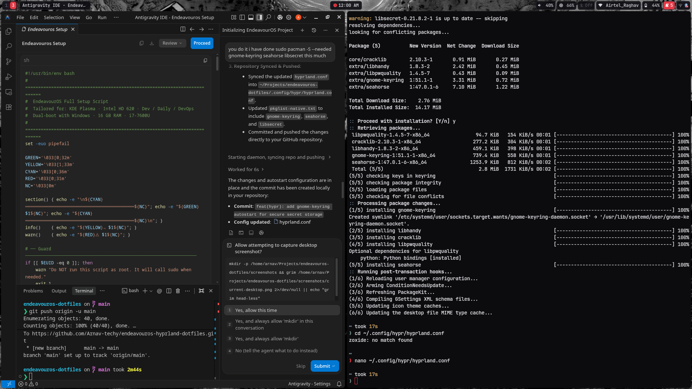
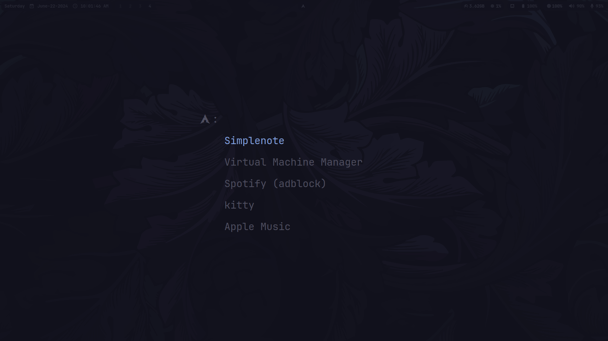
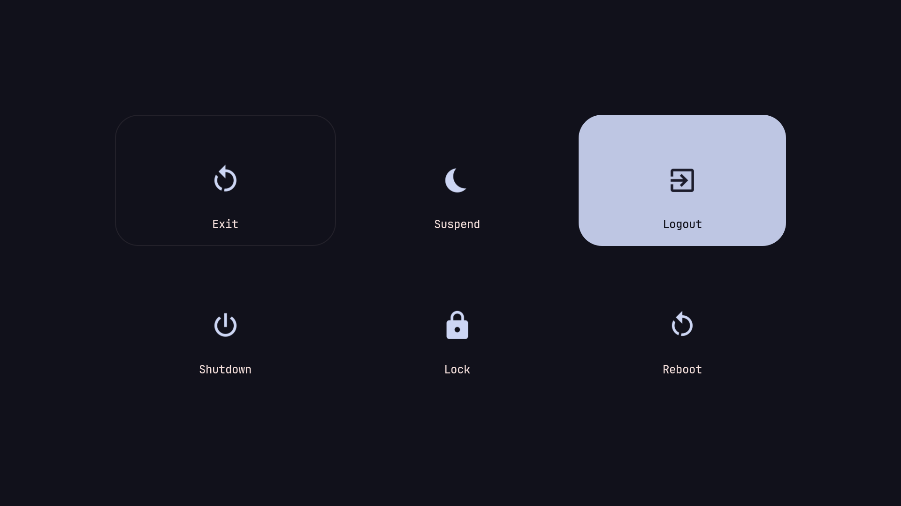

<div align="center">

# ⚔️ Berserk Edition — EndeavourOS / Arch Hyprland Dotfiles

A sleek, dark, and high-performance **Hyprland** setup crafted with a **Berserk (Guts & Eclipse)** theme aesthetic for EndeavourOS / Arch Linux.

[](https://archlinux.org/)
[](https://endeavouros.com/)
[](https://hyprland.org/)

---

### 📸 Desktop Preview



</div>

---

## 🎨 Screenshots & Components

| **Active Workspace** | **Tofi App Launcher** |
|:---:|:---:|
|  |  |

| **Berserk Wallpaper Art** | **Wlogout Power Menu** |
|:---:|:---:|
|  |  |

---

## ⚡ Overview & Stack

| Component | Software / Utility | Description |
|---|---|---|
| **Compositor** | [Hyprland](https://hyprland.org/) | Dynamic tiling Wayland compositor with smooth animations |
| **Status Bar** | [Waybar](https://github.com/Alexays/Waybar) | Highly customizable top bar with custom widgets & scripts |
| **Terminal** | [Kitty](https://sw.kovidgoyal.net/kitty/) | GPU-accelerated terminal with custom Berserk dark palette |
| **Launcher** | [Tofi](https://github.com/philj56/tofi) | Ultra-fast Wayland dynamic app launcher and clipboard picker |
| **Notification Center** | [SwayNC](https://github.com/ErikReider/SwayNotificationCenter) | Wayland notification daemon with full control center |
| **Wallpaper Engine** | [Waypaper](https://github.com/anufrievroman/waypaper) + `swaybg` | GUI wallpaper manager loaded with Berserk wallpapers |
| **Screen Locker** | [Hyprlock](https://github.com/hyprwm/hyprlock) | Fast, aesthetic Wayland screen locker |
| **Idle Daemon** | [Hypridle](https://github.com/hyprwm/hypridle) | Wayland-native idle listener daemon |
| **Power Menu** | [Wlogout](https://github.com/ArtsyMacaw/wlogout) | Elegant Wayland logout / power menu |
| **Keyring / Secrets** | [Gnome-Keyring](https://wiki.gnome.org/Projects/GnomeKeyring) | Secure FreeDesktop Secret Service backend |
| **Screenshots** | `grimblast` + `slurp` | Instant area / window / screen capture with notification |

---

## ⌨️ Keybindings Cheatsheet

> **Note**: `$mainMod` is the **Super** (`Windows`) key.

### 🚀 Applications & Launchers
| Keybinding | Action |
|---|---|
| `SUPER + T` | Open Terminal (`kitty`) |
| `SUPER + A` | Open Application Launcher (`tofi`) |
| `SUPER + B` | Launch Web Browser (`thorium-browser` / default browser) |
| `SUPER + F` | Open File Manager (`dolphin`) |
| `SUPER + C` | Open Code Editor (`code`) |
| `SUPER + S` | Open Secondary Editor (`subl`) |
| `SUPER + V` | Open Clipboard History (`tofi` + `cliphist`) |
| `SUPER + E` | Emoji Picker (`jome` + clipboard copy) |
| `SUPER + P` | Color Picker (`hyprpicker`) |
| `SUPER + SHIFT + W` | Open Wallpaper Manager (`waypaper`) |

### 🪟 Window Management
| Keybinding | Action |
|---|---|
| `SUPER + Q` | Close active window |
| `SUPER + W` | Toggle floating mode for active window |
| `SUPER + J` | Toggle window split orientation |
| `SUPER + M` | Exit Hyprland session |
| `SUPER + [←/↓/↑/→]` | Move focus across tiled windows |
| `SUPER + SHIFT + [←/↓/↑/→]` | Move active window position |

### 🖥️ Workspaces
| Keybinding | Action |
|---|---|
| `SUPER + [1 - 9, 0]` | Switch to Workspace `1 - 10` |
| `SUPER + SHIFT + [1 - 9, 0]` | Move active window to Workspace `1 - 10` |
| `SUPER + SHIFT + S` | Move window to special (magic scratchpad) workspace |
| `SUPER + Mouse Scroll` | Cycle through workspaces |

### 📸 Screenshots & System Controls
| Keybinding | Action |
|---|---|
| `Print` | Capture Full Screen (saved + copied to clipboard) |
| `SUPER + Print` | Capture Active Window |
| `SUPER + ALT + Print` | Select & Capture Screen Area |
| `SUPER + L` | Lock Screen (`hyprlock`) |
| `SUPER + ESC` | Power / Logout Menu (`wlogout`) |
| `CTRL + ESC` | Toggle Waybar visibility |
| `XF86AudioRaiseVolume` / `Lower` | Adjust volume (`pamixer`) |
| `XF86AudioMute` / `MicMute` | Toggle audio / microphone mute |
| `XF86MonBrightnessUp` / `Down` | Adjust screen brightness |
| `XF86AudioPlay` / `Next` / `Prev` | Media playback controls |

---

## 📦 Installation Guide

Follow these steps to reproduce this exact setup on a fresh **EndeavourOS** or **Arch Linux** system:

### 1. Clone the Repository
```bash
git clone https://github.com/Arnav-techy/endeavouros-hyprland-dotfiles.git ~/Projects/endeavouros-dotfiles
cd ~/Projects/endeavouros-dotfiles
```

### 2. Install Required Packages

#### Official Packages (via `pacman`):
```bash
sudo pacman -S --needed - < pkglist-native.txt
```

#### AUR Packages (via `yay`):
```bash
yay -S --needed - < pkglist-aur.txt
```

### 3. Deploy Configuration Files
Run the automated installation script to create clean symbolic links for your user environment:
```bash
./install.sh
```

*(The installer automatically backs up any existing configurations to `.bak` files before linking).*

### 4. Apply Berserk Wallpapers
The wallpapers are included in `.config/assets/backgrounds/`.
- Launch `waypaper` (`SUPER + SHIFT + W`) and select `~/.config/assets/backgrounds/berserk_eclipse.jpg` (or your preferred Berserk backdrop).
- Or let `hyprland.conf` automatically apply it on login via `swaybg`.

---

## 📁 Repository Structure

```
endeavouros-dotfiles/
├── .config/
│   ├── assets/              # Berserk wallpapers, backgrounds & icons
│   │   └── backgrounds/     # Eclipse, Brand of Sacrifice & dark gothic wallpapers
│   ├── dunst/               # Notification fallback config
│   ├── hypr/                # Hyprland compositor, hyprlock, hypridle configs
│   ├── kitty/               # Kitty terminal config & color themes
│   ├── swaync/              # SwayNotificationCenter theme & style
│   ├── tofi/                # Tofi launcher & clipboard selector configs
│   ├── waybar/              # Waybar bar modules, custom scripts & CSS
│   ├── waypaper/            # Wallpaper switcher config
│   └── wlogout/             # Power menu layout and styling
├── screenshots/             # Previews and showcase screenshots
├── .bashrc                  # Customized shell settings and aliases
├── .gitignore               # Ignored cache and temporary backup files
├── install.sh               # Automated backup & symlink setup script
├── pkglist-native.txt       # Official Arch/EndeavourOS package list
├── pkglist-aur.txt          # AUR packages list (yay)
└── README.md                # Documentation & cheatsheet
```

---

## 🛠️ Key Customizations

- **Custom Waybar Scripts**: Check `.config/waybar/scripts/` for interactive WiFi menu dialogs and custom brightness widgets.
- **Secure Keyring**: Includes FreeDesktop Secret Service daemon autostart for seamless GitHub & IDE authentication on Wayland.
- **Dynamic Clipboard**: Supercharged clipboard history stored safely via `cliphist` and searchable through `tofi`.

---

<div align="center">

*“In this world, is the destiny of mankind controlled by some transcendental entity or law?”* ⚔️

</div>
